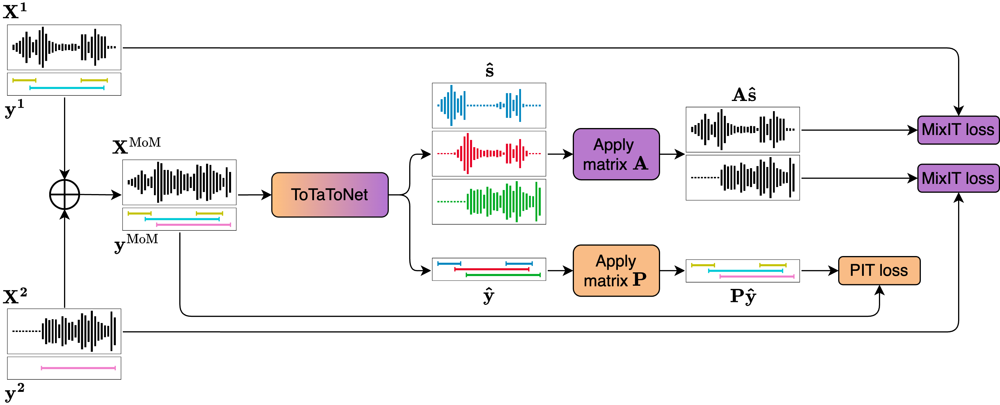
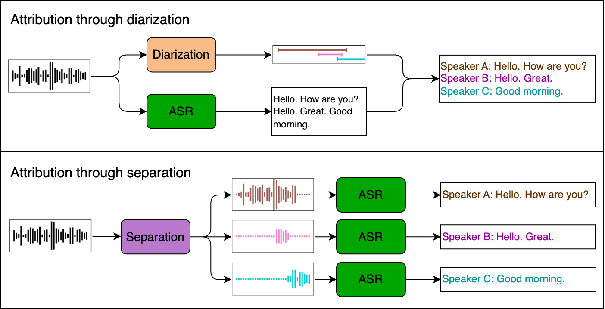

# PixIT: Joint Training of Speaker Diarization and Speech Separation from Real-world Multi-speaker Recordings
Authors: Joonas Kalda, Clément Pagés, Ricard Marxer, Tanel Alumäe, Hervé Bredin  
Odyssey 2024: The Speaker and Language Recognition Workshop  
[Paper](https://www.isca-archive.org/odyssey_2024/kalda24_odyssey.pdf)

> A major drawback of supervised speech separation (SSep) systems is their reliance on synthetic data, leading to poor real-world generalization. Mixture invariant training (MixIT) was proposed as an unsupervised alternative that uses real recordings, yet struggles with over-separation and adapting to long-form audio. We introduce PixIT, a joint approach that combines permutation invariant training (PIT) for speaker diarization (SD) and MixIT for SSep. With a small extra requirement of needing SD labels, it solves the problem of over-separation and allows stitching local separated sources leveraging existing work on clustering-based neural SD. We measure the quality of the separated sources via applying automatic speech recognition (ASR) systems to them. PixIT boosts the performance of various ASR systems across two meeting corpora both in terms of the speaker-attributed and utterance-based word error rates while not requiring any fine-tuning.



## Samples
Listen to samples of long-form separated sources [here](https://joonaskalda.github.io/PixIT/). These are obtained by performing inference with the ToTaToNet trained on AMI-SDM. The inputs are full audio files from AMI-SDM test set. Minute-long separation and diarization samples are extracted from overlap-heavy parts of the test files.

## Code and pretrained models 

The code for both training and inference using PixIT is available as part of version 3.3.0 of [pyannote.audio](https://github.com/pyannote/pyannote-audio). A ToTaToNet checkpoint for AMI-SDM is available [here](https://huggingface.co/pyannote/separation-ami-1.0). A joint inference pipeline trained on AMI-SDM is  available [here](https://huggingface.co/pyannote/speech-separation-ami-1.0).

## Evaluation
Clean reference signals are not available for real-world data so we measure the speech separation quality of PixIT through speaker-attributed ASR. We use speaker-agnostic ASR systems without finetuning and compare doing speaker attribution either through diarization or PixIT's long-form separation as shown in the figure below.  



### Dependencies for cpWER evaluation
Installing required dependencies: 
```
pip install pyannote.audio[separation]==3.3.0, openai-whisper, whisperx, jiwer
```
You will also need to setup the AMI database with pyannote-audio as shown [here](https://github.com/pyannote/AMI-diarization-setup/).

### Calculating cpWER on AMI-SDM for attribution through separation
Calculating cpWER requires references where the words are grouped by speaker. Let's create these, assuming that the manual annotations for AMI are stored in /path/to/ami_public_manual/ (so that the word-level transcriptions are stored in /path/to/ami_public_manual/words/).

```
python create_cpwer_references.py -i /path/to/ami_public_manual/ -o /path/to/cpwer/reference/
```

After references are created we can calculate the cpWER scores:

```
python eval_cpwer.py --references-dir /path/to/cpwer/reference/ --database-dir /path/to/ami-sdm/database.yml --access-token HUGGINGFACE_ACCESS_TOKEN_GOES_HERE
```

On one A100-40gb, this should take roughly an hour to run.

## Training your own model

Installing required dependencies: 
```
pip install pyannote.audio[separation]==3.3.0
```
The following script trains a ToTaToNet on AMI-SDM according to the configurations of the paper. You will again need to have set up the AMI database with pyannote-audio as shown [here](https://github.com/pyannote/AMI-diarization-setup/).

```
python train.py --database-dir /path/to/ami-sdm/database.yml 
```
